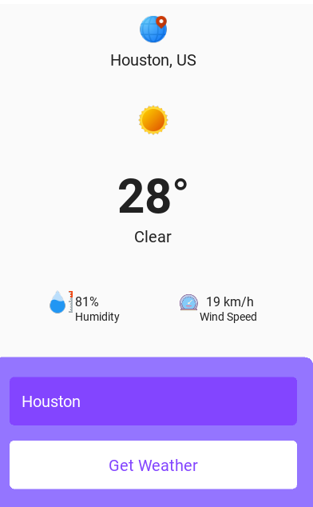
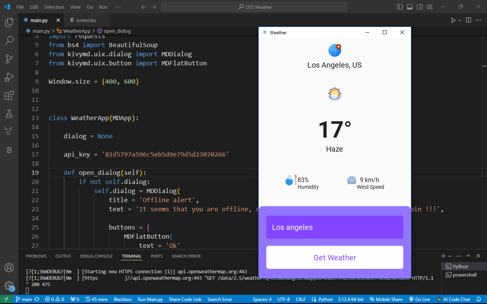

OSS Weather App
================

A weather app built with KivyMD and Python that retrieves weather information from OpenWeatherMap API.

Description
-----------

This app allows users to search for weather information by city name or automatically detect their current location using Google search results. The app displays the current temperature, humidity, wind speed, and weather conditions.

Features
--------

* Search for weather information by city name
* Automatically detect current location using Google search results
* Display current temperature, humidity, wind speed, and weather conditions

Setup
-----

### Requirements

* Python 3.7 or later
* KivyMD library
* OpenWeatherMap API key (free account)

### Installation

1. Clone the repository: `git clone https://github.com/OumarouSandaSouley/oss-weather.git`
2. Install the required libraries: `pip install -r requirements.txt`
3. Replace the value of api_key in the main.py with your OpenWeatherMap API key 
4. Run the app: `python main.py`

Usage
-----

1. Run the app
2. Search for weather information by city name or click the "Current Location" button
3. The app will display the current weather information

Screenshots
----------

## Screenshots

### Screenshot 1

### Screenshot 2

License
-------

This project is licensed under the MIT License.

Contributing
------------

Contributions are welcome! If you want to contribute to this project, please fork the repository and submit a pull request.

Issues
------

If you encounter any issues or have suggestions, please create an issue on this repository.

Author
------

Oumarou Sanda Souley

Acknowledgments
---------------

* KivyMD library for providing the GUI framework
* OpenWeatherMap API for providing the weather data
